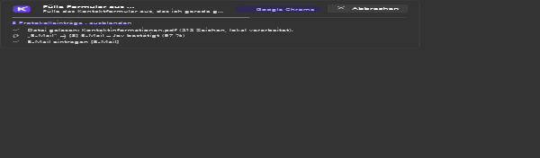

# Kairo

**Kairo ist ein nativer KI-Agent für Windows, der deinen Computer bedient.** Du drückst **Strg+Alt+K**,
beschreibst die Aufgabe in normaler Sprache und Kairo erledigt sie mit echten Windows-Aktionen. Zum Beispiel:

> „Fülle das Kontaktformular aus, das ich gerade geöffnet habe. Meine Kontaktinformationen findest du unter
> C:\Users\Max\Documents\Kontaktinformationen.pdf.“

Kairo erkennt die aktive Anwendung und das Formular, liest die PDF lokal und trägt die Werte ein. Danach prüft
es das Ergebnis und fragt, bevor es etwas absendet.



- **Native Windows-App:** C#/.NET 10, WPF (MVVM), Fluent-Design mit Mica/Acryl, hell und dunkel. Kein Electron.
- **Strukturierte Steuerung vor Simulation:**
  - Browser-DOM über eine eigene Chrome/Edge-Erweiterung (Native Messaging),
  - Windows UI Automation für jede andere Anwendung,
  - SendInput und Screenshot-Analyse nur als Rückfallebene.
- **Schnelle KI-Entscheidungen:**
  - Das Planungsmodell über OpenRouter plant ganze Schritt-Batches.
  - **TypeSafe Jev** über die OpenRouter Decisions API wählt pro Batch in *einem* Aufruf (typisch 70–500 ms)
    unter den tatsächlich gültigen Aktionen aus.
  - Details in [docs/JEV.md](docs/JEV.md).
- **Sicherheit:**
  - Permission Manager mit Freigaben für sensible und nicht umkehrbare Aktionen.
  - Prompt-Injection-Schutz; Webseiten und Dokumente gelten nur als Daten.
  - Dateizugriffsgrenzen.
  - API-Schlüssel mit DPAPI verschlüsselt.
  - IBAN- und Kartennummern in Texten werden vor dem Versand an KI-Modelle durch Platzhalter ersetzt. Das gilt
    nicht für Bilder im Screenshot-Fallback.
- **Jederzeit abbrechbar:** Abbrechen im Overlay oder Nothalt-Hotkey **Strg+Alt+Umschalt+K**. Danach wird
  keine einzige Aktion mehr ausgeführt.

## Inhalt

- [Installation und Einrichtung](#installation-und-einrichtung)
- [Benutzung](#benutzung)
- [Aus dem Quellcode bauen](#aus-dem-quellcode-bauen)
- [Tests](#tests)
- [Projektstruktur](#projektstruktur)
- [Dokumentation](#dokumentation)
- [Status: was verifiziert ist und was nicht](#status-was-verifiziert-ist-und-was-nicht)

## Installation und Einrichtung

Ausführlich in [docs/INSTALLATION.md](docs/INSTALLATION.md).

1. `Kairo-<Version>-x64.msi` von der [Releases-Seite](https://github.com/julianhintermann-cmd/JevControl/releases)
   herunterladen und ausführen. Die Installation erfolgt pro Benutzer, ohne Administratorrechte und
   ohne vorinstalliertes .NET. Im Assistenten wählst du Desktopverknüpfung und Autostart.
2. Beim ersten Start fragt Kairo nach deinem **OpenRouter-API-Schlüssel** und prüft ihn samt Modellen und Jev
   (siehe [docs/OPENROUTER.md](docs/OPENROUTER.md)).
3. Optional für Chrome/Edge: die **Kairo-Browser-Erweiterung** laden (entpackt aus dem Installationsordner).
   Ohne Erweiterung bedient Kairo Browser über UI Automation.

## Benutzung

| Aktion | Tastatur |
|--------|----------|
| Overlay öffnen | **Strg+Alt+K** (änderbar) |
| Aufgabe starten | **Enter** |
| Zeilenumbruch | **Umschalt+Enter** |
| Overlay schließen | **Esc** |
| Aufgabe sofort stoppen (auch ohne Overlay) | **Strg+Alt+Umschalt+K** |

Beispiele:
- „Öffne die Excel-Datei Kontakte.xlsx auf meinem Desktop und übertrage die erste Zeile in das geöffnete CRM.“
- „Wechsle zu Outlook und schreib eine Antwort an Anna, dass ich morgen um 10 Uhr Zeit habe.“ Vor dem Senden
  fragt Kairo nach einer Freigabe.
- „Verschiebe alle PDFs aus Downloads in den Ordner Dokumente\Rechnungen.“

Das Tray-Symbol bietet:
- Schnellzugriff,
- die letzten Aufgaben,
- **Computersteuerung pausieren**,
- Einstellungen: Allgemein, API und Modelle, Computersteuerung, Sicherheit, Datenschutz, Erscheinungsbild,
  Tastenkombinationen, Aufgabenverlauf mit Kosten, Über Kairo.

## Aus dem Quellcode bauen

Voraussetzungen: Windows 10 1809+ / 11 x64, [.NET SDK 10](https://dotnet.microsoft.com/download).

```powershell
dotnet build Kairo.sln -c Release
dotnet run --project src/Kairo.App -c Release
```

Installer (self-contained, WiX v5):

```powershell
./installer/build.ps1 -Configuration Release -Version 1.0.0
# → artifacts/installer/Kairo-1.0.0-x64.msi
```

Mehr in [docs/DEVELOPMENT.md](docs/DEVELOPMENT.md) und [installer/README.md](installer/README.md).

## Tests

```powershell
dotnet test tests/Kairo.Core.Tests        # Unit-Tests (auch Linux)
dotnet test tests/Kairo.Windows.Tests     # echte UI Automation, Hotkeys, DPAPI, Overlay
dotnet test tests/Kairo.E2E.Tests         # kompletter Agent auf nativem Formular und in Edge
cd tests/extension; npm test              # Browser-Erweiterung in Chromium
./installer/test-install.ps1 -Msi <msi>   # Installation und Deinstallation
```

Welche Tests welche Anforderung abdecken und wie die manuelle End-to-End-Prüfung abläuft, steht in
[docs/TESTING.md](docs/TESTING.md).

Alle Ebenen laufen in GitHub Actions auf `ubuntu-latest` und `windows-latest`
(`.github/workflows/ci.yml`).

## Projektstruktur

| Pfad | Inhalt |
|------|--------|
| `src/Kairo.Core` | Agent, Planer, Jev- und OpenRouter-Client, Sicherheit, Dateien, Einstellungen (plattformunabhängig) |
| `src/Kairo.Windows` | UI Automation, Browser-Bridge, SendInput, Graphics Capture, DPAPI, Hotkeys |
| `src/Kairo.App` | WPF-App `Kairo.exe`: Overlay, Onboarding, Einstellungen, Tray |
| `src/Kairo.BrowserHost` | Native-Messaging-Host `Kairo.BrowserHost.exe` |
| `extension/` | Chrome/Edge-Erweiterung (Manifest V3) |
| `installer/` | WiX-Installer, Build- und Testskripte |
| `tests/` | Unit-, Integrations-, E2E- und Erweiterungstests, Testformular |
| `docs/` | Dokumentation |

## Dokumentation

| Dokument | Inhalt |
|----------|--------|
| [INSTALLATION.md](docs/INSTALLATION.md) | Installation, Erweiterung, Deinstallation |
| [OPENROUTER.md](docs/OPENROUTER.md) | Schlüssel, Modelle, Kosten, Fehler |
| [JEV.md](docs/JEV.md) | Jev-Integration und Entscheidungslogik |
| [ARCHITECTURE.md](docs/ARCHITECTURE.md) | Architekturübersicht und Ablauf einer Aufgabe |
| [SECURITY.md](docs/SECURITY.md) | Sicherheitskonzept |
| [DEVELOPMENT.md](docs/DEVELOPMENT.md) | Entwicklerdokumentation |
| [TESTING.md](docs/TESTING.md) | Testanleitung, Anforderungsabdeckung, manuelle E2E-Checkliste |
| [BROWSER-BRIDGE.md](docs/BROWSER-BRIDGE.md) | Protokoll Erweiterung ↔ Kairo |

## Status: was verifiziert ist und was nicht

Die Prüfung erfolgt automatisiert in GitHub Actions: `ubuntu-latest` und `windows-latest` (Windows Server
2025 mit interaktiver Desktop-Sitzung).

**Automatisiert verifiziert** (letzter vollständig grüner Lauf: CI #8)
- Build aller Projekte; 100 Unit-Tests (Agent-Schleife, Jev-/OpenRouter-Protokoll, Planer, Sicherheit,
  Datei-Leser).
- Browser-Erweiterung: 43 Tests in echtem Chromium, inklusive Native Messaging.
- Windows-Integration (25 Tests) mit echten Fenstern und echter Eingabe:
  - DPAPI-Speicherung des Schlüssels,
  - globaler Hotkey inklusive Konflikterkennung,
  - Overlay über echten Tastendruck Strg+Alt+K: sichtbar und fokussiert rund 10 ms nach dem Hotkey; Enter,
    Umschalt+Enter und Esc funktionieren,
  - UI Automation (Lesen, Ausfüllen, Auswählen, Ankreuzen, Absenden),
  - SendInput-Korrektur,
  - Windows Graphics Capture mit Maskierung,
  - Zwischenablage und App-Start,
  - Native-Messaging-Relay mit dem echten `Kairo.BrowserHost.exe`.
- End-to-End (7 Tests). Hier ersetzen ein skriptgesteuerter Planer und ein lexikalisches
  Entscheidungsmodell im Jev-Format die KI-Modelle. Wahrnehmung, Zielauflösung, Freigaben, Ausführung,
  Verifikation und Abbruch sind Produktionscode.
  - **Natives Testformular:** Ausfüllen aus einer PDF; Freigabe vor dem Absenden; abgelehntes Absenden wird
    nicht ausgeführt; Abbruch während der Planung und während des Tippens.
  - **Microsoft Edge über UI Automation:** Webformular aus einer PDF ausgefüllt, alle 8 Eingaben bestätigt,
    Freigabe, Absenden. Der lokale Server prüft die per POST empfangenen Werte.
  - **Microsoft Edge mit der echten Kairo-Erweiterung (DOM-Pfad):** Webformular aus einer PDF ausgefüllt,
    Werte per DOM zurückgelesen.
- Alle Oberflächen hell und dunkel auf Windows gerendert, siehe [docs/screenshots](docs/screenshots).
- Installer:
  - Das MSI (WiX v5, x64, pro Benutzer, self-contained, ca. 77 MB) wird gebaut.
  - Die stille Installation wird geprüft: Dateien, Startmenü- und Desktopverknüpfung, Autostart,
    Native-Messaging-Registrierung.
  - `Kairo.exe --selftest` läuft aus der Installation.
  - Deinstallation mit Behalten der Daten, Neuinstallation und Deinstallation mit sicherem Löschen der Daten
    sind erfolgreich (`installer/test-install.ps1`).

**Nicht verifiziert bzw. bewusst offen**
- **Live-Aufrufe an OpenRouter und Jev** wurden nicht ausgeführt, weil in der Entwicklungsumgebung kein
  API-Schlüssel vorlag.
  - Endpunkte und Formate sind nach den öffentlichen Referenzimplementierungen umgesetzt (siehe
    [docs/JEV.md](docs/JEV.md)).
  - Die Live-Tests (`LiveModelTests`) laufen automatisch, sobald das Repository-Secret `OPENROUTER_API_KEY`
    gesetzt ist.
- **Standardmodelle** (`anthropic/claude-sonnet-5`, `~typesafe/jev-latest`) sind nicht gegen die Live-Modellliste
  geprüft. Der Verbindungstest prüft sie und schlägt verfügbare Alternativen vor.
- **Vision-Fallback:** Die Screenshot-Aufnahme ist auf Windows getestet, die Analyse durch ein Vision-Modell
  nur mit Test-Doubles.
- **Signatur:** Der Installer ist **nicht signiert**, weil kein Code-Signing-Zertifikat vorliegt. Die CI signiert
  automatisch, sobald eines hinterlegt ist.
- **Browser-Erweiterung:** Sie ist nicht im Chrome Web Store bzw. bei den Edge-Add-ons veröffentlicht und muss
  entpackt geladen werden.
- **Testsystem:** Getestet wurde auf Windows Server 2025 (CI), nicht auf Windows 10/11-Clients. Mica/Acryl und
  Mehrmonitor-Setups sind nicht automatisiert geprüft.
- **UI-Ereignisse:** UIA-`StructureChanged`-Ereignisse löst die CI-Umgebung nicht aus. Kairo nutzt dort den
  zeitbasierten Cache-Ablauf, der Test wird als übersprungen gemeldet.
- **Lizenz:** Der Lizenztext im Installer (`installer/License.rtf`, MIT) ist ein Platzhalter. Die Lizenz des
  Projekts ist noch festzulegen.
